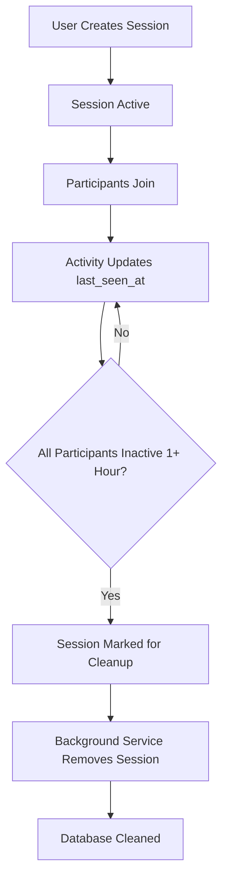
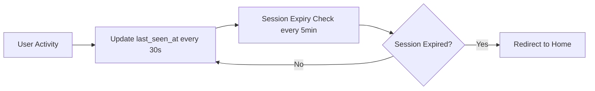

# Session Monitoring & Cleanup Architecture

## Overview

TarotForge implements a comprehensive session monitoring and cleanup system to ensure optimal performance, resource management, and user experience in collaborative reading rooms. This system automatically manages session lifecycles, prevents resource waste, and provides clear feedback to users when sessions expire.

## 🏗️ Architecture Components

### 1. Database Layer
**Location:** `supabase/migrations/20241201_session_cleanup.sql`

#### Tables Enhanced:
- **`reading_sessions`** - Core session data with `updated_at` tracking
- **`session_participants`** - Participant tracking with `last_seen_at` timestamps

#### Key Database Functions:

```sql
-- Removes sessions inactive for 1+ hour
cleanup_inactive_sessions()

-- Checks if specific session has expired
check_session_expiry(session_id_param UUID)

-- Auto-updates participant last_seen_at on activity
update_participant_last_seen()
```

#### Indexes for Performance:
```sql
-- Fast cleanup queries
idx_session_participants_last_seen
idx_reading_sessions_updated_at
```

### 2. Store Layer
**Location:** `src/stores/readingSessionStore.ts`

#### Enhanced Interface:
```typescript
interface SessionParticipant {
  id: string;
  sessionId: string;
  userId: string | null;
  anonymousId: string | null;
  name: string | null;
  isActive: boolean;
  joinedAt: string;
  lastSeenAt?: string; // 🆕 Activity tracking
}
```

#### Key Store Methods:
- `cleanupInactiveSessions()` - Manual cleanup trigger
- `checkSessionExpiry()` - Check if current session expired
- Enhanced `joinSession()` with link expiration validation
- Automatic presence updates every 30 seconds

### 3. Background Service
**Location:** `src/utils/sessionCleanup.ts`

#### SessionCleanupService Features:
- **Singleton Pattern** - One instance per app
- **Automatic Startup** - Runs every 15 minutes
- **Manual Cleanup** - On-demand cleanup methods
- **Statistics** - Session health monitoring

### 4. Application Integration
**Location:** `src/App.tsx`

Auto-starts cleanup service on app initialization.

## 🔄 System Flow

### Session Lifecycle



### Real-time Monitoring



## ⏰ Timing Configuration

| Component | Interval | Purpose |
|-----------|----------|---------|
| Presence Updates | 30 seconds | Track user activity |
| Session Expiry Checks | 5 minutes | Monitor current session |
| Background Cleanup | 15 minutes | Remove old sessions |
| Session Timeout | 1 hour | Inactivity threshold |

## 🔗 Link Expiration System

### Two-Layer Protection:

#### 1. Link Expiration (Immediate)
**Location:** `joinSession()` in `readingSessionStore.ts`

```typescript
// Check if session link has expired (1 hour of inactivity)
if (accessMethod === 'invite') {
  const { data: participants } = await supabase
    .from('session_participants')
    .select('last_seen_at')
    .eq('session_id', sessionId)
    .eq('is_active', true)
    .order('last_seen_at', { ascending: false })
    .limit(1);

  if (participants && participants.length > 0) {
    const lastActivity = new Date(participants[0].last_seen_at || session.updated_at);
    const hoursSinceActivity = (Date.now() - lastActivity.getTime()) / (1000 * 60 * 60);
    
    if (hoursSinceActivity > 1) {
      throw new Error('This invitation link has expired. Sessions become inactive after 1 hour of no activity.');
    }
  }
}
```

#### 2. Session Cleanup (Background)
Automatic database maintenance removes expired sessions.

## 🎯 User Experience Flow

### Successful Join:
```
User clicks invite link → Link validation passes → Join session → Normal experience
```

### Expired Link:
```
User clicks expired invite link → Link validation fails → Error screen → Navigation options
```

### Error Screen Features:
- **Clear messaging:** "This invitation link has expired..."
- **Navigation options:** Home, Marketplace
- **Professional styling:** Warning icon, card layout
- **Responsive design:** Works on mobile and desktop

## 🧪 Testing Guide

### Manual Testing

#### 1. Test Link Expiration:
```bash
# Create a session
1. Start reading room
2. Share invite link
3. Wait 1+ hour (or modify timeout for testing)
4. Click invite link
5. Verify error message appears
```

#### 2. Test Session Cleanup:
```bash
# Monitor cleanup service
1. Check browser console for cleanup logs
2. Verify sessions removed from database
3. Check cleanup statistics
```

#### 3. Test Real-time Expiry:
```bash
# Test current session expiry
1. Join active session
2. Wait for expiry (or simulate)
3. Verify automatic redirect
```

### Automated Testing

#### Database Testing:
```sql
-- Test cleanup function
SELECT cleanup_inactive_sessions();

-- Check session expiry
SELECT check_session_expiry('session-id-here');

-- Verify indexes
EXPLAIN ANALYZE SELECT * FROM session_participants 
WHERE last_seen_at < NOW() - INTERVAL '1 hour';
```

#### Service Testing:
```typescript
// Test cleanup service
const service = SessionCleanupService.getInstance();
await service.runCleanup();
const stats = await service.getCleanupStats();
console.log('Cleanup stats:', stats);
```

## 📊 Monitoring & Debugging

### Console Logs to Monitor:

#### Store Activity:
```
"Updating participant presence for session: {sessionId}"
"Session expiry check: {result}"
"Cleaning up inactive sessions..."
```

#### Service Activity:
```
"SessionCleanupService started with interval: 15 minutes"
"Cleanup completed. Removed X sessions"
"Cleanup stats: {totalSessions, activeSessions, inactiveSessions}"
```

#### Error Scenarios:
```
"Error joining session: This invitation link has expired..."
"Session expired, redirecting to home"
"Cleanup failed: {error}"
```

### Database Queries for Monitoring:

```sql
-- Active sessions count
SELECT COUNT(*) FROM reading_sessions WHERE is_active = true;

-- Sessions by activity
SELECT 
  COUNT(*) as total_sessions,
  COUNT(CASE WHEN updated_at > NOW() - INTERVAL '1 hour' THEN 1 END) as recent_activity,
  COUNT(CASE WHEN updated_at <= NOW() - INTERVAL '1 hour' THEN 1 END) as old_sessions
FROM reading_sessions WHERE is_active = true;

-- Participant activity
SELECT 
  session_id,
  COUNT(*) as participant_count,
  MAX(last_seen_at) as last_activity
FROM session_participants 
WHERE is_active = true 
GROUP BY session_id;
```

## 🔧 Configuration

### Environment Variables:
```env
# Session timeout (hours)
SESSION_TIMEOUT_HOURS=1

# Cleanup interval (minutes)  
CLEANUP_INTERVAL_MINUTES=15

# Presence update interval (seconds)
PRESENCE_UPDATE_SECONDS=30
```

### Customization Points:

#### Timing Adjustments:
```typescript
// In sessionCleanupService.ts
service.start(30); // Change cleanup interval to 30 minutes

// In readingSessionStore.ts
setInterval(updatePresence, 60000); // Change presence to 60 seconds
```

#### Timeout Modifications:
```typescript
// In joinSession function
if (hoursSinceActivity > 2) { // Change from 1 to 2 hours
  throw new Error('Session expired after 2 hours of inactivity');
}
```

## 🚨 Error Handling

### Error Types:

1. **Link Expiration:** User-friendly message with navigation
2. **Session Cleanup Failure:** Logged, doesn't affect user experience  
3. **Database Connection Issues:** Graceful fallback to local state
4. **Permission Errors:** Clear messaging for authentication issues

### Recovery Mechanisms:

- **Automatic retries** for transient failures
- **Local state preservation** during network issues
- **Graceful degradation** when cleanup fails
- **Clear user feedback** for all error states

## 📈 Performance Considerations

### Optimizations:
- **Database indexes** for fast cleanup queries
- **Batched operations** for large-scale cleanup
- **Efficient presence updates** (only when needed)
- **Background processing** doesn't block user interactions

### Resource Management:
- **Automatic session removal** prevents database bloat
- **Participant cleanup** removes orphaned records
- **Memory-efficient** service with minimal overhead
- **Configurable intervals** for different environments

## 🔮 Future Enhancements

### Potential Improvements:
1. **Session analytics** - Track usage patterns
2. **Predictive cleanup** - ML-based session lifecycle prediction
3. **User notifications** - Warn before session expiry
4. **Session recovery** - Restore recently expired sessions
5. **Advanced monitoring** - Real-time dashboard for session health

This architecture provides a robust, scalable solution for managing collaborative tarot reading sessions while maintaining excellent user experience and system performance. 