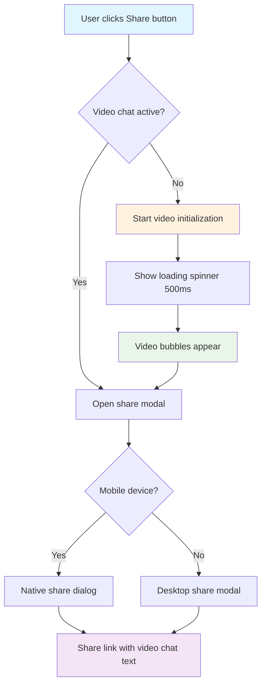
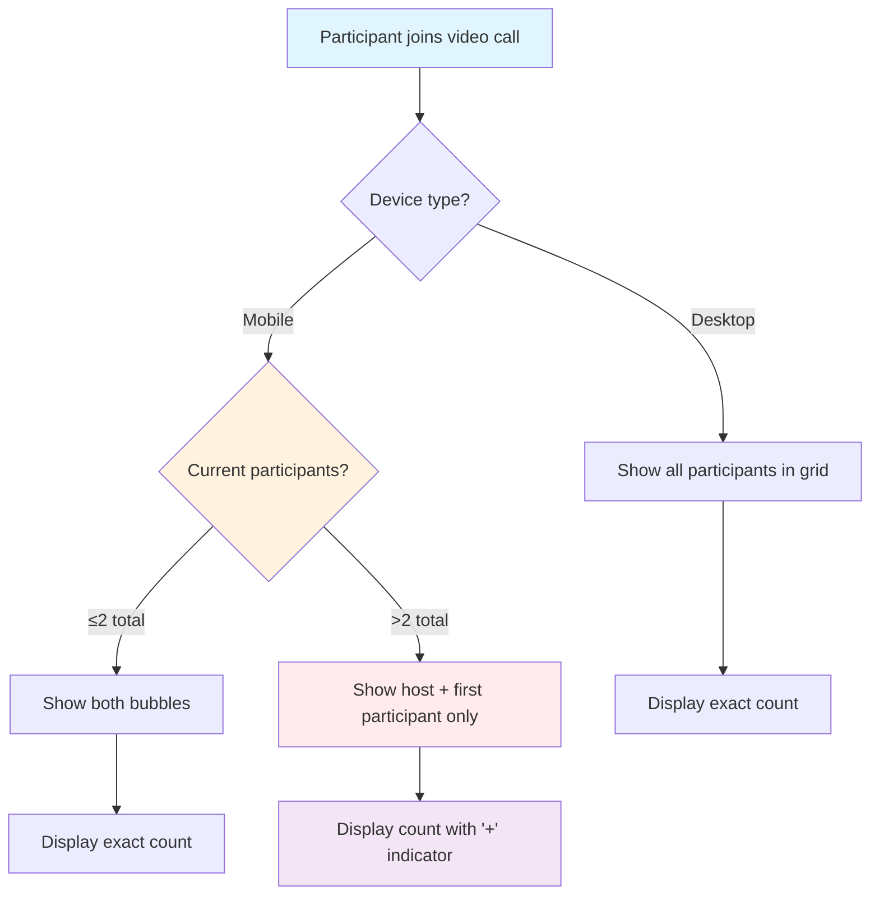
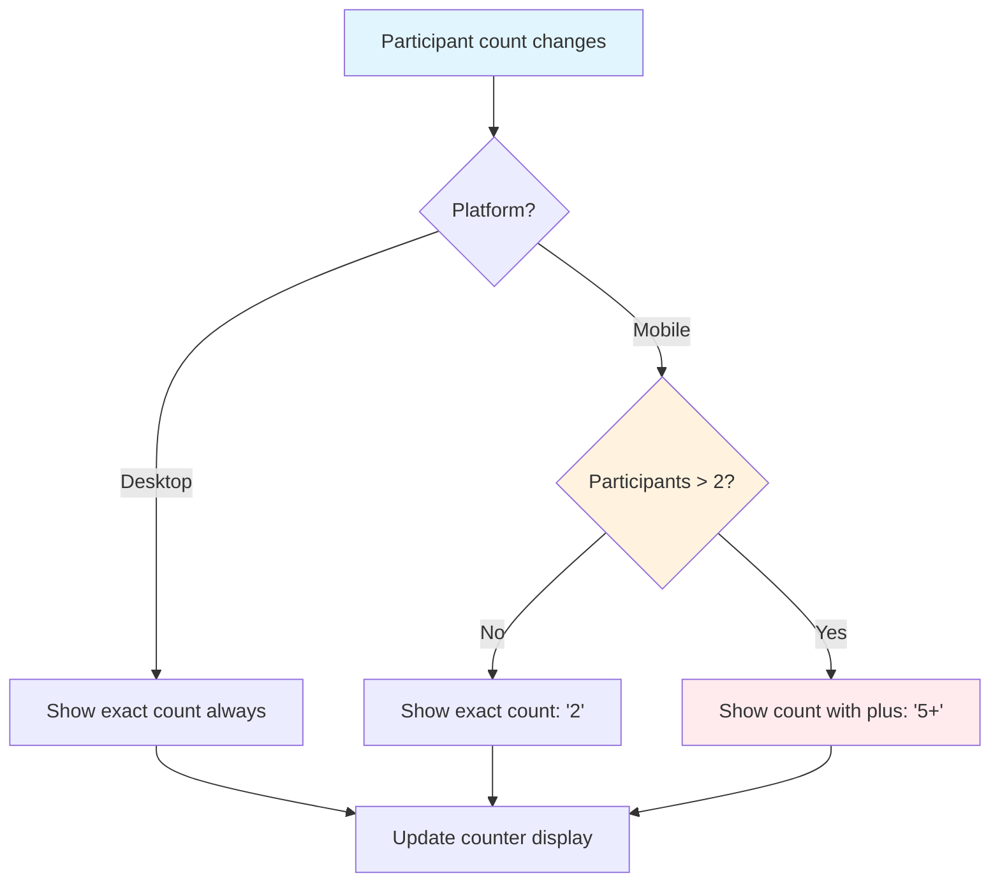

# Video Call UI Interaction Flows

## Visual Flow Diagrams

### 1. Share Button Auto-Start Flow



### 2. Mobile Bubble Limit Flow



### 3. Participant Counter Logic



---

## Step-by-Step UI States

### Desktop Share Flow

#### State 1: Initial Reading Room
```
┌─────────────────────────────────────────────────────┐
│ [←] TarotForge    [?] [Share] [👤]                  │
├─────────────────────────────────────────────────────┤
│                                                     │
│              Tarot Reading Interface                │
│                                                     │
│         [Card 1]  [Card 2]  [Card 3]               │
│                                                     │
└─────────────────────────────────────────────────────┘
```

#### State 2: Share Button Clicked (Loading)
```
┌─────────────────────────────────────────────────────┐
│ [←] TarotForge    [?] [🔄] [👤]                     │
├─────────────────────────────────────────────────────┤
│                                                     │
│              Tarot Reading Interface                │
│                                                     │
│         [Card 1]  [Card 2]  [Card 3]               │
│                                                     │
└─────────────────────────────────────────────────────┘
```

#### State 3: Video Bubbles Appear + Share Modal
```
┌─────────────────────────────────────────────────────┐
│ [←] TarotForge    [?] [Share] [👤]                  │
├─────────────────────────────────────────────────────┤
│  [You]                                              │
│                                                     │
│         [Card 1]  [Card 2]  [Card 3]               │
│                                                     │
│    ┌─────────────────────────────┐                  │
│    │ Share Reading Room          │                  │
│    │ ─────────────────────────── │                  │
│    │ Share this link with others │                  │
│    │ to invite them to your      │                  │
│    │ reading room with video     │                  │
│    │ chat.                       │                  │
│    │                             │                  │
│    │ ✓ Video chat is now active! │                  │
│    │                             │                  │
│    │ [Copy Link] [Done]          │                  │
│    └─────────────────────────────┘                  │
└─────────────────────────────────────────────────────┘
```

### Mobile Share Flow

#### State 1: Mobile Reading Room
```
┌─────────────────────┐
│ [←] [?] [Share] [👤] │
├─────────────────────┤
│                     │
│    Tarot Reading    │
│                     │
│   [Card 1]          │
│   [Card 2]          │
│   [Card 3]          │
│                     │
└─────────────────────┘
```

#### State 2: Video Bubbles + Native Share
```
┌─────────────────────┐
│ [←] [?] [Share] [👤] │
├─────────────────────┤
│ [You] [Remote]      │
│                     │
│   [Card 1]          │
│   [Card 2]          │
│   [Card 3]          │
│                     │
│ ┌─────────────────┐ │
│ │ Share via...    │ │
│ │ • Messages      │ │
│ │ • Email         │ │
│ │ • Copy Link     │ │
│ └─────────────────┘ │
└─────────────────────┘
```

---

## Bubble Positioning Examples

### Desktop Grid Layouts

#### 2 Participants
```
┌─────────────────────────────────────┐
│                                     │
│     [Local]        [Remote 1]       │
│                                     │
└─────────────────────────────────────┘
```

#### 4 Participants
```
┌─────────────────────────────────────┐
│                                     │
│  [Local]  [Remote 1]  [Remote 2]    │
│                                     │
│           [Remote 3]                │
│                                     │
└─────────────────────────────────────┘
```

#### 6 Participants
```
┌─────────────────────────────────────┐
│                                     │
│  [Local]  [Remote 1]  [Remote 2]    │
│                                     │
│  [Remote 3] [Remote 4] [Remote 5]   │
│                                     │
└─────────────────────────────────────┘
```

### Mobile Layouts (Always 2 Max)

#### 2 Participants
```
┌─────────────────────┐
│                     │
│  [Local] [Remote]   │
│                     │
│      Counter: 2     │
└─────────────────────┘
```

#### 5 Participants (Mobile View)
```
┌─────────────────────┐
│                     │
│  [Local] [Remote]   │ ← Only first remote shown
│                     │
│     Counter: 5+     │ ← Indicates more participants
└─────────────────────┘
```

---

## Interactive Element States

### Share Button States

#### Idle State
```
┌─────────┐
│ [Share] │ ← Default appearance
└─────────┘
```

#### Loading State
```
┌─────────┐
│  [🔄]   │ ← Spinner animation
└─────────┘
```

#### Active State (after video starts)
```
┌─────────┐
│ [Share] │ ← Same appearance, but video bubbles visible
└─────────┘
```

### Video Bubble States

#### Local Bubble (Camera On)
```
┌─────────────┐
│ [Live Video]│
│             │
│    "You"    │
│ [🎤] [📹]   │
└─────────────┘
```

#### Local Bubble (Camera Off)
```
┌─────────────┐
│    [👤]     │
│             │
│"You (Off)"  │
│ [🎤] [📹]   │
└─────────────┘
```

#### Remote Bubble (Connected)
```
┌─────────────┐
│ [Live Video]│
│             │
│"Participant"│
│     [2]     │
└─────────────┘
```

#### Remote Bubble (Connecting)
```
┌─────────────┐
│    [🔄]     │
│             │
│"Connecting" │
│             │
└─────────────┘
```

### Participant Counter States

#### Desktop Counter
```
┌─────────────────┐
│ 3 participants  │
└─────────────────┘
```

#### Mobile Counter (Normal)
```
┌─────┐
│  3  │
└─────┘
```

#### Mobile Counter (Overflow)
```
┌─────┐
│ 5+  │ ← Indicates hidden participants
└─────┘
```

---

## Animation Sequences

### Share Button Click Animation
1. **Click** → Button press effect (100ms)
2. **Loading** → Spinner appears (500ms)
3. **Video Start** → Bubbles fade in (300ms)
4. **Modal Open** → Share modal slides up (300ms)

### Participant Join Animation
1. **New Connection** → Placeholder bubble appears
2. **Stream Ready** → Video fades in (200ms)
3. **Position Adjust** → Smooth movement to final position (400ms)
4. **Counter Update** → Number change with highlight (200ms)

### Mobile Overflow Animation
1. **3rd Participant Joins** → Counter changes from "2" to "3+"
2. **Highlight Effect** → Brief color change to indicate update
3. **Bubble Limit** → No new bubble appears (mobile only)

---

## Error State Handling

### Permission Denied Flow
```
[Share] → [🔄] → [❌ Permission Denied] → [Continue without video?]
                                      → [Yes] → [Share modal only]
                                      → [No] → [Cancel]
```

### Connection Failed Flow
```
[Video Bubble] → [🔄 Connecting] → [❌ Failed] → [Retry] → [🔄 Connecting]
                                              → [Cancel] → [Remove bubble]
```

### Network Issues Flow
```
[Active Video] → [⚠️ Poor Connection] → [Reduce Quality] → [Continue]
                                     → [Audio Only] → [Continue]
                                     → [Disconnect] → [Remove bubble]
``` 